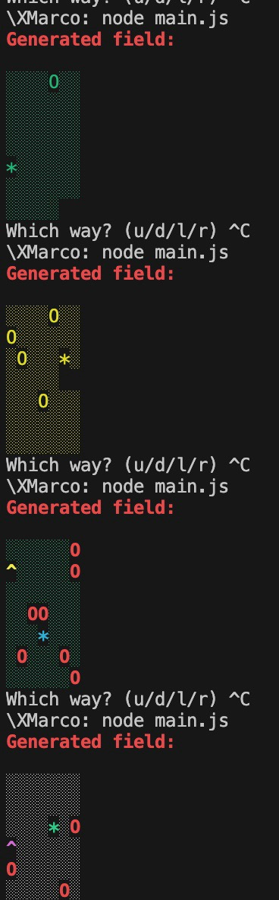
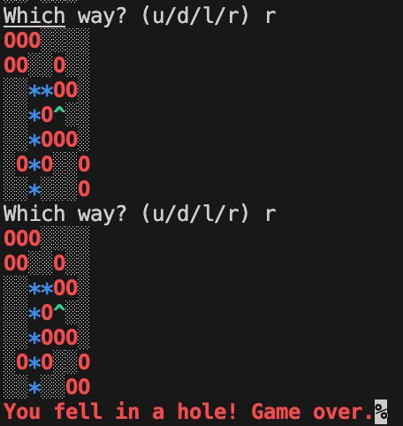
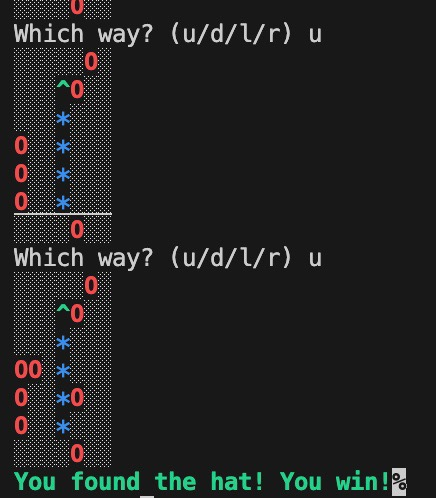
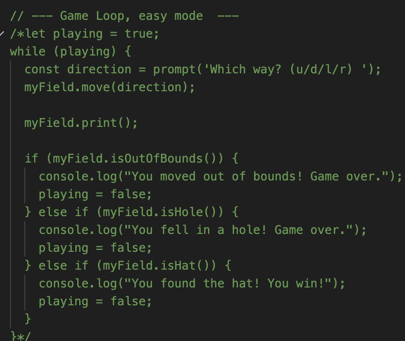
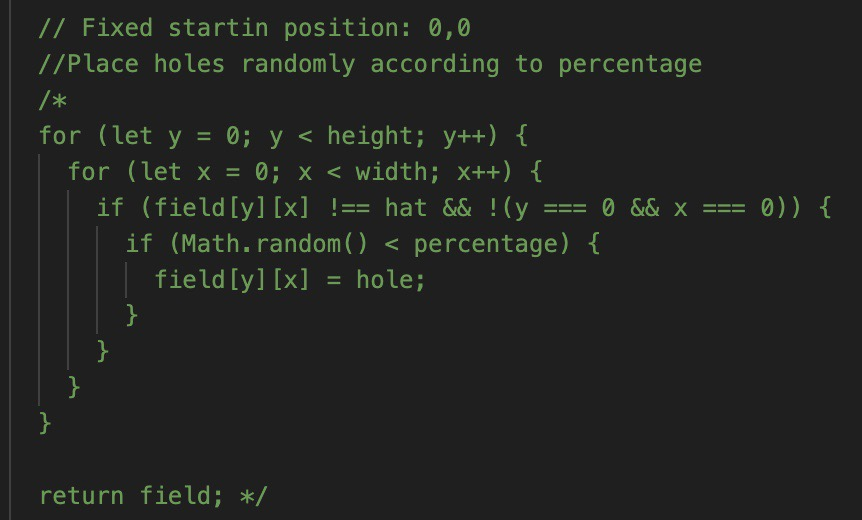

# CODECADEMY PROJECT FIND THE HAT

## TABLE OF CONTENTS

- [Content](#content)
- [Rules](#rules)
- [Commands](#commands)
- [Switch Difficulty](#difficulty)
- [Start game](#start)

## Content

I. **Project Context** 

This is a mini-terminal game where you would need to create a path to the hat so you can win the game.

## Rules

I. **Rules**

The rules are simple:
- Player's Location/Player's Path: *
- Available fields: ░;
- Hat's Location: ^
- Holes' Location: O

The Player MUST reach the **Hat's Location** so that it can win the game avoiding the holes around the path.
Check the [Commands](#commands) to know how to move throught the available #Fields.

## Commands

I. **Keyboard Commands**

Following the game's instructions, move:
- A: left;
- S: down;
- D: right;
- W: up;

The player's icon will move following your own commands

## Difficulty

The difficulty of this game is on easy and hard and you can also set the position on a random part of the field.

**Easy Mode**:
The player must move through the whole field, avoid the holes to reach the hat's position.

**Hard Mode**:
Everytime the player moves, 2 random holes will appear in the field.

To switch difficulty, follow the istructions below.

I. **Uncomment Code to switch difficulty**

In main.js there are some commented parts. I updated the mini-game to be on the hard mode and at a random starting position but since this app has different settings, you can uncomment some parts of the code to switch on easy mode, which means no holes are created during your moves and you can also set your starting position fixed or random

- *Fixed* means you will always start at 0,0 which is at the top left corner of the whole field.
- *Random* means everytime you start a new game, the player's location will be totally random through the whole field.

### EASY MODE

### FIXED LOCATION

## IMPORTANT NOTE

This app uses a stric *MAZE SOLVER* which means that whenever you play on the hard mode and new holes appears, you might think that there would be some fields which are impossible to be played meaning the hat won't be reachable cause the holes will prevent you to have a clear path toward it. 
This is called **BFS** which is a grid traversal algorithm which will avoid impossible games ensuring that everytime a field is created there won't be unreachable or impossible paths to the hat. 

## Start

To start game type on the terminal **node main.js**

# ENJOY!
